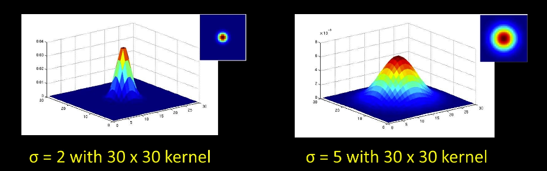

# Computer Vision Basics

> These notes are incomplete because I needed to stop the course. I will continue with it someday. Till that day even this little information can be useful.

Here you can find my notes on the Georgia Tech online course [Introduction to Computer Vision](https://www.udacity.com/course/introduction-to-computer-vision--ud810). The course practices are in Matlab/Octave. Because I don't want to use those software, here you will find the same practices done with python and python frameworks.

## Index of course

1. Introduction
2. Image processing for computer vision
3. Camera models and views
4. Features and matching
5. Lightness and brightness
6. Image motion
7. Motion and tracking
8. Classification and recognition
9. Miscellaneous operations
10. Human vision

## Introduction

### Description

Computer Vision (CV) aims to interpret images and extract information from them. Its not image processing (IMG input, IMG output) but it is used on CV.

It's important to note the different between "seeing" something and measure something.


The photo corresponds to the Adelson's same color illusion, in it, the squares A and B have the same color. So seeing is not the same as measuring properties of an image. Seeing implies some understanding (perception) of the image (there is a cylinder that cast a shadow and that change the color of the square). CV aims to seeing, not to measure things (actually made by sensors). Here is another example (click in the image to see the video).

<a href="https://www.youtube.com/watch?v=XZO8-Df3mxA" title="Another example of perception (Dan Kersten video)"></a>


## Image processing for computer vision

### Images as functions

Images can viewed as a coordinate function $R^2 \to R$, like $I(x,y) = v$. These kind of functions will give the intensity (for black-white images) of the image at each coordinate. CV works by applying maps to these functions in order to extract information. Here is a image with a mean function applied and it value representation as a value in the third axis.


Because the values of the images are usually constrained to 8 bytes (or other values), we can say the image is defined inside a rectangle with a finite range. $f: [a,b]\times[x,d]\to[\min,\max]$. There is no problem with defining the image values in the range of $[0,1]$ or even negative $[-1,1]$ ranges. 

An example of a constrained image function. X values can have values from 10 to 100, Y values from 5 to 25 and intensity values from 0 to 10.

$$
f: [10, 100] \times [5,25] \to [0, 10]
$$

A **color image** is just three functions containing color channel intensity stacked together. We can write them as a vector function $R^2 \to R \times R \times R$.

$$
f(x,y) = 
\begin{bmatrix}
r(x,y) \\[0.3em]
g(x,y) \\[0.3em]
b(x,y)
\end{bmatrix}
= 
\begin{bmatrix}
r \\[0.3em]
g \\[0.3em]
b
\end{bmatrix}
$$


On **digital images** representation the space is a 2D discrete regular grid. That means, the image needs to be quantize, or **round the values to the nearest integer**. Nevertheless, when dealing with image processing, it's mandatory to cast the values to *float32* or *float64* representation in order to increase the the mapping algorithms numerically stability and avoid overflows in your operations. The representation its most of the times $X$ (or $j$) for the columns, $Y$ (or $i$) for the rows.


#### Some code snippets

Here you can find some basic code to handle images on python.

**Read an image and iter over the channels.**

```python
import cv2
import matplotlib.pyplot as plt
# Read an image with OpenCV and matplotlib
img = cv2.imread("my_image.png")  # returns a numpy array
# Show the image dimensions and type
img.shape  # something like (300, 300, 3)
img.dtype  # dtype('uint8')
# Show the image
plt.imshow(img)
```

**Iterate over image values**

```python
# Get the separated channels
red_channel = img[:,:,0]
green_channel = img[:,:,1]
blue_channel = img[:,:,2]
# subsample (cropping) the image
img[20]  # row 20 three channels
img[:,50]  # column 50  three channels
img[:,50, 1]  # column 50 green channel
img[20,50]  # one value three channels
img[20,50, 0]  # one value red channel
img[20,50, 1:2] # one value green and blue channels
img[20:40,50:70]  # square of image in three channels
img[20:40,50:70, 0]  # square of image in Red channel
img[20:40,50:70, 2]  # square of image in Blue channel
img[20:40,50:70, 0:1] # square of image in  Red and Green channel
img[:,:,:]  # all the image
```

**Some basics mappings (operations)**

```python
import numpy as np
img2 = cv2.imread("my_image2.png") # second image with same dims as img
# element wise operations
img + img2
img - img2
img2 - img  # not the same
np.abs(img-img2)  # correct img differentiation
img * 0.5
img / 2
(img / 2) + (img2 / 2)  # imgs average
img * img  # this is also element-wise, not matmul
```

#### Noise in images

Noise can be described just as another image coordinate function such as:

$$
I'(x,y) = I(x,y) + n(x,y)
$$

There are some types of common noise functions:

 - Salt and pepper noise: Random black and white pixels.
 - Impulse noise: Random white pixels.
 - Gaussian noise: Random points of intensity sampled from a normal distribution.

```python
# generate gaussian noise matrix of shape img
noise = np.random.rand(*img.shape)  # here the * is called unpacking operator
# just add the noise to the image
img + noise
# modify the variance (sigma) of the gaussian noise
sigma = 32  # or 2, 4, 64, etc
img + (noise*sigma)
```

### Filtering


#### Removing noise by averaging

There are some assumptions in order to use this technique:

1. The "true" value of a pixel is close to the "real" value of the pixels nearby. 
2. The noise added to each pixel is independent (iid) from the other pixels.

Also, there is different ways of filtering by averaging:

 - **Uniform moving average**: All near pixels have the same weight to the mapping.
 - **Non-uniform weighted moving average**: Weights of near pixels decay when more "far away" are from the center. 

 **How to perform moving average in 2D?** The operation is quite simple using what is called [kernels](https://en.wikipedia.org/wiki/Kernel_(image_processing)). In the next image we can see the kernel $H(u,v)$ that corresponds to the uniform moving average. Click in the next image to see a visual explanation.

<a href="https://www.youtube.com/watch?v=tWSV6qOBwHU" title="Moving average in 2D explanation"></a>

 #### Gaussian Filter

The gaussian filter is probably the most used filter on image processing to remove noise. The kernel approximates a gaussian function. It looks like this in a $3\times3$ kernel.

$$
H(u,v) = \frac{1}{16}
\begin{bmatrix}
1 & 2 & 1 \\
2 & 4 & 2 \\
1 & 2 & 1 \\
\end{bmatrix}
$$

One of the most important parameters of the gaussian kernel is the variance (sigma) or amount of smoothing. Take into account that the size of the kernel is not related with the smoothing but with the portion (boundaries or scale) of the distribution you are using.



```python
# use gaussian filter in python with OpenCV
kernel_1d = cv2.getGaussianKernel(ksize=5, sigma=1.0)  # a 5 x5 kernel
kernel_2d = np.multiply(kernel_1d.T, kernel_1d)
cv2.filter2D(img, kernel=kernel_2d, ddepth=-1, borderType=cv2.BORDER_ISOLATED)
# or directly
cv2.GaussianBlur(img , (5, 5), sigmaX=1.0, borderType=cv2.BORDER_ISOLATED)
```

### Linearity and convolution

Linearity is defined when these two properties holds for any function $H$.

 - **Additivity**: $$H(f1 + f2) = H(f1) + H(f2)$$
 - **Multiplicative scaling** (or homogeneity of degree 1): $$H(a\sdot f1) = a \sdot H(f1)$$

 With these definitions, it is straightforward that functions like $sum$ or $diff$ are linear and functions like $max$ or $average$ are not linear. Same affects to image and kernels. Linearity allows to define a function over a signal (an image) and apply the function to it in the same way as applying the same function to each of the pixels independently and sum up the results. This way, a linear kernel can be parallelized and distributed across multiple CPU and computers.

#### Impulse Function

In the discrete set, an impulse is just a signal with one point of value 1. In the continuous set, is an square very narrow and tall that has unit area. Most of the times, CV only cares about impulse functions in the discrete set.


The impulse response $h(t)$ is the result of applying a function $H$ over an impulse. If the function is linear we can describe $H$ with $h(t)$. In the next image we can see the effect of applying a kernel on a impulse image. Note how in the next image the kernel is flipped upside down and left to right.


#### Convolution vs correlation

The cross-correlation formula is

$$
G = H \otimes F \\
G[i,j] = \sum_{u=-k}^{k} \sum_{v=-k}^{k} H[u,v] F[i+u, j+v]
$$

The convolution formula is

$$
G = H \star F \\
G[i,j] = \sum_{u=-k}^{k} \sum_{v=-k}^{k} H[u,v] F[i-u, j-v]
$$

If you note it, the only difference between both is that convolution does not flip the kernel output. The convolution changes the way on how the kernel is iterated, so the output is not flipped. Also note, that for symmetric kernels (like the gaussian filter) the outcome for convolutions and cross-correlations would be the same.

