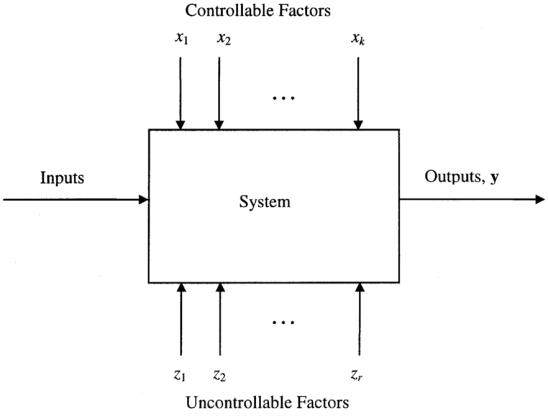
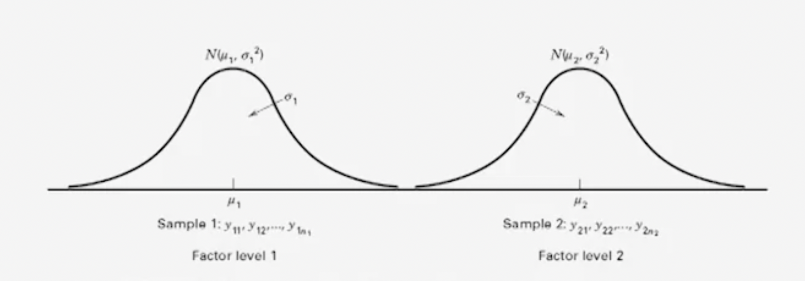
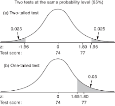
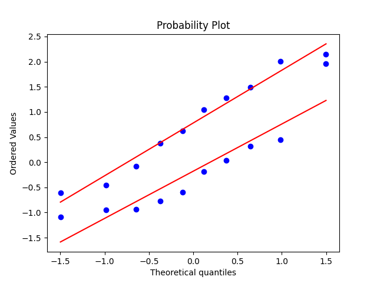
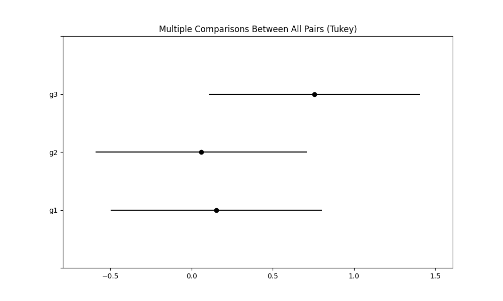
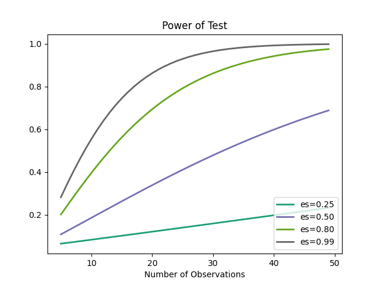
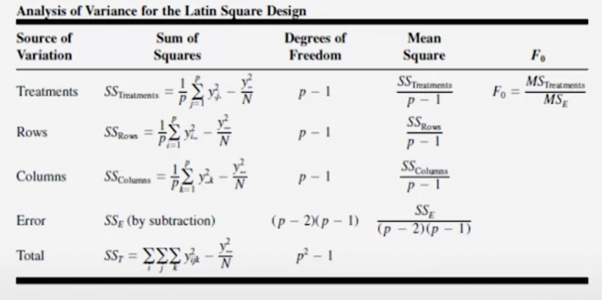

# Experimental Design Basics

Here you can find my notes on the Arizona State University online coursera course [Experimental Design Basics](https://www.coursera.org/learn/introduction-experimental-design-basics) by Douglas C. Montgomery. This is the first part (out of four) of a specialized program [Experimental Design](https://www.coursera.org/specializations/design-experiments). Proprietary computer software packages (JMP, Design-Expert, Minitab) are used in the course, but in these notes you can find the equivalent procedure in python. The lectures are based on the book [Design and Analysis of Experiments, 10th Edition](https://www.wiley.com/en-us/Design+and+Analysis+of+Experiments%2C+10th+Edition-p-9781119492443)

This course aims to explain the basics of scientific experimental design and results analysis using statistical tools. It does not only aims to explain the mathematical foundations but also to plan, design and conduct experiments efficiently and effectively.

## Course Index

1. Introduction to Design and Analysis of Experiments
2. Simple Comparative Experiments
3. Experiments with a Single Factor - The Analysis of Variance
4. Randomized Blocks, Latin Squares, and Related Designs

## 1 - Introduction to Design and Analysis of Experiments

The branch obviously originates with Ronald Fisher. In the mid decade of 1910, Fisher described the principal concepts of the field even nowadays, namely:

 - Randomization, running experiments on a random order.
 - Replication, repeating experiments to gain knowledge about experimental error.
 - Blocking, a technique to control variation in the experiments when dealing with noise or nuisance variables.

Among these, he also developed the techniques of factorial design and analysis of variance. Regarding the analytical methods, this course talks about two-sample t-test (to compare two levels of a factor) and the analysis of variance, a generalization of the previous technique that allows to compare in any kind of experiment.

Finally, the course will talk about a procedure of seven steps to conduct a well-design experiment.

### Definition

As a formal definition, an experiment is a test or a set of inter-related tests that aims to explain the variation of information that depends to a hypothesized set of variables.

> All experiments are design experiments. Some of the are poorly design, some are well-designed

If an experiment is poorly design, you can get incomplete or incorrect conclusions.

Some application examples can be:

 - Reduce **time** to design/develop new products or processes.
 - Improve **performance** of existing process.
 - Evaluation of materials, processes, products, etc.

You can think of an experiment as a black-box system, in which it receives an input and gives out an output. The system is affected by some factors, some of them are controllable while others are not. In an experiment, we try to manipulate those factors to see if we can understand their implications in the way they change the output.



### Principles of DOE

These are the three principles that any well-design experiment need to handle correctly, always.

#### Randomization

Randomization involves running the trials of an experiment in random order. So for example, it would be convenient on a system to run trials of low temperature first and high temperature last. This is an error.

The problem here is, if there are factors you don't know impacted by time, then you will be linking your temperature changes to these **lurking variables**. So the experiment would not valid.

On summary, without randomization statistical tools does not work.

#### Replication

Basically, setting a sufficient **sample size**. By doing so, what you want to accomplish is a experiment with the enough probability to **correctly detect** an effect size of practical value. If the sample size is low, then we could be not sure if the desired effect to detect exists or we weren't able to detect it.

#### Blocking

The technique that allow us to deal with **nuisance factors**. These factors are the ones present on the experiment, that gives no information but need to be handled.

### Strategies of experimentation

How can we start when doing experiments?

#### "Best-guess" experiments

Relying on expert knowledge, a simple "guess" on which factor to try on a experiment. As in the previous example, it's so simple as "let's try with temperature". A disadvantage could happen when no successful experiment occur in a long period of time.

#### One-factor-at-a-time (OFAT)

By setting a baseline level for all your factors, you perform the experiment in several trials by setting constant to their baseline all the factors except one, this one is the one you change in their range. After this trial, you set again this factor to the baseline and try with a different factor. This is extremely inefficient and have lots of disadvantages too. If there is any interaction between factors or the baseline level you set have effect on the system, then your experiment is invalid.

#### Factorial Design

Based on the Fisher's factorial concept these are the statistics designed experiments. If we have multiple factors, we perform trials on all possible value combinations of such factors. 

e.g. If we try to measure the effect of changing from two driver types and two ball types on a golf game, then we will need to perform several trials on games, by changing the drivers and balls **on random order**. This experiment will have two factors with two levels each. After the experiment, we will take the mean differences by driver, ball and interactions of driver-balls. So at the end we will measure three different effect, the driver, the ball and the interaction between both. This can be extended to any experiment with any number of factors and levels.

### Steps of an experiment

These are the seven steps recommended by Montgomery. Conducting an experiment is something you have to follow a strategy in order to succeed. It's crucial you take ownership on this process but try to perform team work. The first three points should take you 80% of your time.

1. **Recognition of the problem**: "This is what we want to accomplish with this particular experiment".
2. **Choose the factors**: The number of levels and ranges of those factors and nuisance factors. Keep the levels low, two or three.
3. **Selection of the response variable**: What are you going to measure? In the last example it was the game score.
4. **Choose the design**: Mainly the software you are going to use.
5. **Conduct the experiment**: As an advise from Montgomery. Conduct the experiment by yourself and if you can't, just be there when it happens. Lot's of thing go wrong during this part.
6. **Analyze the data**: With modern software this is quite easy if everything before have been done correctly. No statistical tool will help you if the experiment is not well-design.
7. **Draw conclusions**: Graphics helps a lot when communicating the results. They are preferred over complex variance tables.

As a final advise, Montgomery say to use the KISS principle. "Keep it simple and sequential". Large experiments often fails because we don't know enough the system when experiment design starts. We learn when conducting multiple experiments. So it's better to run multiple sequential small experiments rather than one large complex experiment.


## 2 - Simple Comparative Experiments

One thing you want to do when experiment data arrives is to visually inspect the actual data. Apart from the datatable, you will also want to use visual plots. Three of the best plots you can use to inspect the data are:
 - Scatter plots: If n is low than 30. Plotting the values differentiating by color is a good idea.
 - Histograms: If n is larger than 30. An histogram can gives you a lot of information about the data distribution.
 - Box plots: Very useful to visually compare between two distributions. Min, max, 25-75 percentile and median is present. Sometimes outliers can also be drawn.

From these plots, you will always want to see the mean and the standard deviation and compare between the samples of the experiment. Nevertheless, this way of discern if there are differences between two experiments is not so scientifically. In order to do it properly we used the hypothesis framework.

### Hypothesis framework

The hypothesis framework is a way of reductio ad absurdum reasoning. Here we will assume an initial condition of a system with just two possible disjoint states. If one state is true, then the other one is false. An example of such system could be if a person have siblings (one of the states) or not (the other one). 

In this scenario, we will take one of the states as true, the null hypothesis $H_0$, and then we will try to prove it is false with a level of certainty. If we succeed, then we will reject the null hypothesis and take the alternative one. If we fail, then we do not reject the null hypothesis.

> Note: With this framework we cannot be 100% sure of rejecting or assuming anything. Thats why we use a small enough confidence value.

The mathematical procedure to perform this reasoning is called two sampled t-test. With this procedure we assume that the two factor levels of the system are sampled from a **normal distribution**. 



Then we define the two hypotheses:

$$
H_0 : \mu_1 = \mu_2 \\
H_1 : \mu_1 \neq \mu_2
$$

**Null hypothesis**: Population means of the two level factors are equal.

**Alternative hypothesis**: Population means of the two level factors are not equals.

### Two-sample T-test

To perform the actual test, we need first to estimate the population parameters. 

$$
\bar{y} = \frac{1}{n} \sum_{i=0}^n y_i \\
S^2 = \frac{1}{n-1} \sum_{i=0}^n (y_i - \bar{y})^2
$$

$\bar{y}$ estimates the population mean $\mu$ and $S^2$ estimates the population variance $\sigma^2$. Both are called sample mean and sample variance.

The tests use the sample means to draw conclusions about the population means. Taking the differences of sample means and dividing it by the standard deviations of the differences of sample means we will have a new statistic. With the new statistic we can quantify how likely it is to have such mean differences (in case the null hypothesis is true).

$$
\frac{\text{differences in sample means}}{\text{standard deviation of the differences in sample means}}
$$

This ratio is a measure of how different are the sample means in standard deviation units.

The **standard deviation of an average** is defined as:

$$
\sigma_y^2 = \frac{\sigma^2}{n}
$$

And the **standard deviation of the differences of two averages** is defined as the sum of the std of the averages:

$$
\sigma_{y_1-y_2}^2 = \frac{\sigma_1^2}{n_1} + \frac{\sigma_2^2}{n_2} \text{, if $y_1$ and $y_2$ are independent}
$$

With these definitions we can already plug-in everything to get the statistic to perform the test. In other words we get the standard deviation of the differences of sample means.

$$
Z_0 = \frac{\bar{y}_1 - \bar{y}_2}{\sqrt{\frac{\sigma_1^2}{n_1} + \frac{\sigma_2^2}{n_2}}}
$$

If $\sigma_1^2$ and $\sigma_2^2$ are known to be equal, then the $Z_0$ statistic follows a normal distribution $N(0,1)$. In this scenario it will be straightforward to measure how likely is to get those mean differences.

```python
# draw samples from a normal distribution
from scipy import stats
g1 = stats.norm.rvs(size=10)
g2 = stats.norm.rvs(size=10)

# perform ztest
from statsmodels.stats import weightstats
tstat, pvalue = weightstats.ztest(g1, g2, alternative="two-sided")
```

To do that, just measure where the $Z_0$ statistic value lands on the $N(0,1)$ distribution. If it lands on a unlikely place, then we will assume it wasn't because of chance but because the means are not equal, thus we will reject the null hypothesis and take the alternative one.

> Example: Take an experiment that yields you the following values: $\sigma_1^2=\sigma_2^2=0.3$, $\bar{y_1}-\bar{y_2}=-0.28$ and $n=10$. Plug in the values and you will get $Z_0=-2.09$. How unlike is to get that $Z_0$ value? The 95% of the $N(0,1)$ area is between the values $Z_{0.025}=1.96$ and $-Z_{0.025}=-1.96$ so the $Z_0$ we get is outside that range. In other words, 95% of the times we will not get such value in the differences of means if means are equal. So we reject the null hypothesis, in this case, with a 5% of significance.

This type of test, is called fixed significance level test, because we compare the t-statistic value to a **critical value** (1.96) selected before running the experiment.

#### The P-value

Testing using a p-value instead a critical value is very popular. The computation is quite easy for the t-test. Just take the probability in $N(0,1)$ of your $Z_0$ value and multiply by two. Multiplying by two is needed because this test is a two-tailed test.



In science and engineering fields is quite common to use p-value=0.05 as a rule of thumb. Nevertheless, Montgomery recommends to use higher p-values, like 0.1 or even 0.15, in early stages of an experiment when you will be doing new discoveries. Performing Type I errors, that is, assuming a factor level is important when it's not, is not so important at early stages. In the end you will find a factor level is not important in case you make an error. On the other hand, Type II errors, rejecting factor levels when they are important, are devastating at early stages of experimentation because they will be discarded forever.

> Example: In the previous example, $Z_0=2.09$ give us a probability of $0.01832$, if we multiply by 2 we get $0.03662$. Because this is lower than p-value $=0.05$ we reject the null hypothesis.

The z-statistic is usually used to represent the sample values in terms of zscore. The zscore measure how far are the sample values from the mean in terms of standard deviation.

```python
# compute the zscores of a sample
stats.zscore(g1)
```

#### What if we don't know the population variance?

If we don't know $\sigma^2$ then we can plug in the sample variance $S^2$ only if the sample size $n$ is greater than 30 or 40. In other words, the Z-statistic is a good statistic only for large samples.

#### What if the sample size is small?

If the sample size is lower than 30, then we cannot use the $N(0,1)$ distribution as a groundtruth. Instead, we will use the t-statistic and the sample variances. This is called **pooled two-sample t-test**. Because we are assuming both sample variances are equal, the t-statistic formula will be:

$$
t_0 = \frac{\bar{y}_1 - \bar{y}_2}{S_P\sqrt{\frac{1}{n_1} + \frac{1}{n_2}}}
$$

with $S_p$ being called **pooled standard deviation** it's computed from the root square of

$$
S_p^2 = \frac{(n_1-1)S_1^2+(n_2-1)S_2^2}{n_1+n_2-2}
$$

This statistic can be interpreted as a signal-to-noise ratio. The numerator would be the signal, and the denominator would represent the variance or noise. Again, the statistic measure how far are the sample means in terms of sample variances. 

So if we get a t-statistic value of -2.20 then we can interpretive as the two sample means are more than 2 standard deviation apart one from the another. But, How unusual is to get this value? In this case, to answer the question we need to use the t-distribution.

```python
# sample from a t-distribution
stats.t.rvs(df=6, size=10)
```

The t-distribution is quite similar to the normal distribution, but it have a little more of spread in the tail. The spread is controlled by the degrees of freedom. The **degrees of freedom* are $n_1+n_2-2$.

With this in mind, we can perform the same procedure as the one with the Z statistic.

```python
# perform two-sample t-test
t_statistic, p_value = stats.ttest_ind(g1, g2, equal_var=True, alternative="two-sided")

# complete test using statsmodels
d1 = weightstats.DescrStatsW(g1)
d2 = weightstats.DescrStatsW(g2)
test = weightstats.CompareMeans(d1, d2)
print(test.summary())
#                           Test for equality of means                          
# ==============================================================================
#                  coef    std err          t      P>|t|      [0.025      0.975]
# ------------------------------------------------------------------------------
# subset #1      0.9588      0.427      2.248      0.037       0.063       1.855
# ==============================================================================
```

#### Checking assumptions of the test

It's important to always check the assumptions. Mainly, the normality of samples and equal variances. One way to easily check this assumption is just plot as probplot for the two samples. In this plot, if points are close to the line then normality holds. If both lines slopes are close to be parallel then both samples have the same variance.

The normality assumption is not so important. If both distributions are symmetric and unimodal the t-test works well. If equal variability is not hold, then the test lacks of sensitivity and therefore it would not be able to detect any differences in the effects.

```python
# plot probplot
import matplotlib.pyplot as plt

stats.probplot(g1, plot=plt)
stats.probplot(g2, plot=plt)
plt.show()
```



#### What if the variances are not equal?

If variances of the sample are not equal, then we cannot use the previous methods. Instead we will just plug in the sample variances in the z-statistic formula.

$$
Z_0 = \frac{\bar{y}_1 - \bar{y}_2}{\sqrt{\frac{S_1^2}{n_1} + \frac{S_2^2}{n_2}}}
$$

The problem here is that the statistic is no longer distributed exactly as a t-distribution. A little adjustment in the degrees of freedom need to be performed.

$$
v = \frac{(\frac{S_1^2}{n_1} + \frac{S_2^2}{n_2})^2}{\frac{(S_1^2/n_1)^2}{n_1-1} + \frac{(S_2^2/n_2)^2}{n_2-1}}
$$

The new statistic follows approximately a t-distribution with $v$ degrees of freedom. This test is called **Welch's t-test**.

```python
# perform welch's t-test for unequal variances. Note the false in the parameters
t_statistic, p_value = stats.ttest_ind(g1, g2, equal_var=False, alternative="two-sided")
```

### One-sample t-test

There are sometimes we want to perform a test with only one sample, comparing the population mean $\mu$ to a predefined value $\mu_0$. In these cases the predefined value is usually a threshold, acceptance level, boundary, etc. The hypotheses are:

$$
H_0: \mu = \mu_0 \\
H_1: \mu \neq \mu_0 \\
$$

and the formula for the statistic is

$$
Z_0 = \frac{\bar{y}-\mu}{\sigma / \sqrt{n}}
$$

The procedure is similar to the previous methods because this statistic also follows a $N(0,1)$ distribution.

#### What if we don't know the population variance on the one-sample t-test?

As in the previous methods, we just plug-in the sample standard deviation:

$$
Z_0 = \frac{\bar{y}-\mu}{S / \sqrt{n}}
$$

Here, the new statistic also follows a t-distribution with $n-1$ degrees of freedom. After this, the procedure is similar as the previous one for two-sample t-test with unknown population variance.

### Test on variances, F-test

These tests are called F-tests but they are not mentioned on the course. These tests are usually used when performing OLS and linear model fitting well-of-fit test. [See more in the wikipedia page.](https://en.wikipedia.org/wiki/F-test)

### Paired t-test

There are sometimes you will want to perform a test on different machines, persons or any pair of things. The paired t-test is also known as the dependent samples t-test, the paired-difference t-test, the matched pairs t-test and the repeated-samples t-test.

Examples for use are scores of the same set of student in different exams, or repeated sampling from the same units. For example, you want to know if two machines that apparently perform the same cut on a piece of metal actually perform it with the same level of quality. In this scenario you can take 20 pieces of metal and perform the cuts in 10 pieces with one machine and the other 10 cuts with the other one. This have a great disadvantage, the called **block effect**. That is the characteristics of each piece of metal affects the way in which the cut is performed. In other words, the result variability will be greater due the block effect.

A way to reduce this effect is to perform the cut on the 20 pieces but with the two machines. This way, we can compare two different cuts on each of the metal pieces, reducing this way the effect of the metal particular characteristics.

With this in mind, the experimental design will be to perform a paired t-test on the differences of measurement pairs. In the example, instead of taking the measurement in metal piece 1 for cut1 and cut2, we perform cut1 $-$ cut2 for metal piece 1 and repeat for all the metal pieces.

The hypotheses will be:

$$
H_0 : \mu_d = 0 \\
H_1 : \mu_d \neq 0
$$

with the test statistic

$$
t_0 = \frac{\bar{d}}{S_d \sqrt{n}}
$$

being $\bar{d}$ the sample mean of differences and $S_d$ the sample standard deviation of the differences

$$
\bar{d} = \frac{1}{n} \sum_{j=1}^n d_j \\
S_d = \sqrt{ \frac{\sum_{j=1}^n (d_j - \bar{d})^2}{n-1}  }
$$

From here, the way of proceeding is similar as in the two-sample t-test. The statistic will follow a t-distribution with $n-1$ degrees of freedom. Also take care to check for normality in the differences.

Note that this approach have a lot of advantages, so it's preferred over normal two-sample t-test when possible.

```python
# paired t-test
# Note: ensure order of p1 and p2 is correct
t_statistic, p_value = stats.ttest_rel(p1, p2, alternative="two-sided")
```

## 3 - Experiments with a Single Factor - The Analysis of Variance

From the previous chapter, all experiments had one factor with two levels. Here we are going to see experiments of one factor with multiple levels and how to analyze them.

The tool used to deal with these kind of experiments is called Analysis of Variance or ANOVA. In it, there will be:
 - $a$ numbers of factors or treatments
 - $n$ replicates of the experiment runs in a completely randomized design (CRD)
 - $N=a \sdot n$ will be the total number of runs.
 
There is also two settings for ANOVA:

 - **Fixed-effects ANOVA**: It assumes the particular levels of the experiment have been chosen by the researcher and the hypothesis will be to check for equality on the means of those levels.
 - **Random-effects ANOVA**: On it, the level values are chosen at random. We test for differences in variance components.

The name ANOVA comes from the partitioning of the total variability in the response variable into components of the experiment model. In other words, ANOVA assumes an underlying model that explains the experiment and one of its components defines the variability.

 ### Fixed-Effects ANOVA

For a single factor ANOVA the underlying model is:

$$
y_{ij} = \mu + \tau_i + \epsilon_{ij}
$$

 - $i = 1,2,\dots,a$
 - $j = 1,2,\dots,n$
 - $y_{ij}$ is the $j$ observation in the $i$ treatment. 
 - $\mu$ is the overall mean. Constant to all of the observations.
 - $\tau_i$ is the effect of the individual $i$ treatment.
 - $\epsilon_{ij}$ is the random error $\sim N(0, \sigma^2)$.

 With this framework, if the treatment effects differ it's because the $\tau_i$ components are different. This model is called **the effects model**.

 If you let $\mu_i=\mu+\tau_i$ and then $y_{ij}=\mu_i+\epsilon_{ij}$ this is called **the means model**. Albeit regression models can also be used. 

#### Total variability

The total variability of a model is measured as the total sum of squares:

$$
SS_T = \sum_{i=1}^{a} \sum_{j=1}^{n} (y_{ij} - \bar{y})^2
$$

This can be separated into two different components:

$$
\sum_{i=1}^{a} \sum_{j=1}^{n} (y_{ij} - \bar{y})^2 = n \sum_{i=1}^{a} (\bar{y_i} - \bar{y})^2 + \sum_{i=1}^{a} \sum_{j=1}^{n} (y_{ij} - \bar{y_i})^2
$$

Then we have

$$
SS_T = SS_{\text{Treatments}} + SS_E
$$

The first term is a sum of squares that reflect how different the treatment averages are from the total average. If the means are equal we could expect $SS_{Treatments}$ to be relatively small mainly because the means would be very similar to the total average. The second term just measures the experimental error, something that does not directly affects the treatments.

Our experimental hypotheses would be:

$$
H_0 : \mu_1 = \mu_2 = \dots = \mu_a \\
H_1 : \text{At least one mean is different}
$$

Because sum of squares cannot be directly compared (they do not use the same magnitude) we can compare mean squares. A **mean square** is a sum of squares divided by its degrees of freedom.

$$
df_{total} = df_{treatments} + df_{error} \\
an - 1 = a - 1 + a(n-1) \\
$$

Then we define the mean square for the components as

$$
MS_{treatment} = \frac{SS_{treatment}}{a-1} \\ \space \\
MS_E = \frac{SS_E}{a(n-1)}
$$

Finally, if means are equal then the mean square for the treatments $MS_{treatment}$ will be equal to the mean square of error $MS_E$. If means differ then $MS_{treatment} > MS_E$ .

The statistic used for the experiment is

$$
F_0 = \frac{MS_{treatments}}{MS_E}
$$

and follows the F-distribution of parameters $a-1$ and $a(n-1)$. For the experiment, the null hypothesis will be rejected if

$$
F_0 > F_{\alpha,a-1,a(n-1)}
$$

with an $\alpha$ value normally set to $0.05$.

```python
# perform ANOVA, alpha==pvalue
from scipy import stats
g3 = stats.norm.rvs(size=10)

f_statistic, pvalue = stats.f_oneway(g1, g2, g3)
```

The F-distribution looks like this


### Checking Assumptions

There are several assumptions to check when performing ANOVA:

- Normality
- Constant Variance (Homoscedasticity)
- Independence through Completely Randomized Design
- Checking for unexplained variability (not right fitted model)

Most of these assumptions can be checked analyzing the **residuals** of the model. A residual is just the actual value minus the predicted value.

$$
e_{ij} = y_{ij} - \hat{y_i}
$$

These values should hold the same assumptions.

```python
# check for assumptions visually
for g in [g1, g2, g3]:
    stats.probplot(g-np.mean(g), plot=plt)
    plt.show()
```

### What to do when the null hypothesis is rejected?

When the null hypothesis is rejected a new problem arise. It's to detect which mean is the different in the group. There are several methods, most popular ones are:

 - Fisher's Least Significant Difference, Fisher LSD
 - Tukey's Honest Significance Test, Tukey's HSD, Tukey's range test
 - Other graphical methods

 These numerical methods basically perform all possible pairwise t-test in order to detect which one is different. With equal means as null hypothesis, if the p-value is low enough then implies the means are different.

```python
import numpy as np
# perform tukey's HSD test
endog = np.concatenate([g1,g2,g3])
groups = np.concatenate([["g1"]*len(g1), ["g2"]*len(g2), ["g3"]*len(g3)])

test = statsmodels.stats.multicomp.pairwise_tukeyhsd(endog, groups, alpha=0.05)
print(test) # p-adj are the pvalues

# individual values can also be accessed
test.pvalues 
test.reject

# graphical test 
test.plot_simultaneous()
plt.show()
```




### Determining Sample Size

Determining the sample size of the experiment is something crucial. There are several factor involved, mainly resources and scope. From the design aspect there are several ways to define the final sample size. The main one is to set the sensitivity of the experiment.

Sensitivity is defined as the differences in means that the experiment is able to detect. In general, increasing the sample size increases the sensitivity, so it's more probable to detect smallest differences in the means. 

#### Sample Size for the fixed effects case

Usually we can define the sample size for the fixed effects case satisfying some levels of Error Type I and Error Type II:

 - Error Type I ($\alpha$): Reject $H_0$ when it's true.
 - Error Type II ($\beta$): Accept (or not reject) $H_0$ when it's false.

From these two definitions we can also define other useful and widely used terms:

 - Power of the experiment: $1-\beta$ 
 - Operating characteristic curves: Linear plot of $\beta$ against parameter $\Phi$

$$
\Phi^2 = \frac{n \sum_{i=1}^{a} \tau_i^2}{a\sigma^2}
$$

As stated before $\tau_i$ is the effect of the individual $i$ treatment. The operating characteristic curve give us information about the amount of sample to use.

Another useful tool is to perform **power analysis**. It consist of plotting sample size in terms of power, the so called power curves. [Full guide.](https://machinelearningmastery.com/statistical-power-and-power-analysis-in-python/)

```python
# plot power curves
import statsmodels.stats.power as power

# effect_size = standardized effect size, difference between the two means divided by the standard deviation
power.TTestIndPower().plot_power(nobs=np.array(range(5,2000)), effect_size=[0.25,0.5,0.8, 0.99])
plt.show()

# compute experiment power for a given sample size
# nobs1 = sample size
power = power.TTestIndPower().solve_power(effect_size=0.1, nobs1=30, alpha=0.05)
```



### Random-effects model

In the random-effects model the factor levels are chosen at random from a population of levels. The experimenter choses $a$ of these levels at random. The tests aims to infer results for the whole population of levels instead of some of them.

The linear model is similar to the fixed-effects test.

$$
y_{ij} = \mu + \tau_i + \epsilon_{ij}
$$

But here, the factor levels $\tau_i$ are sampled at random from a $N(0,\sigma^2_\tau)$. Because $\tau_i$ are independent from $\epsilon_{ij}$ the variance of any observation is:

$$
V(y_{ij}) = \sigma^2_\tau + \sigma^2
$$

The $\sigma^2_\tau$ components are called **variance components** and we want to estimate those. The random-effects model is sometimes called **variance components model**.

There are a covariance structure in this model. For any two observations of different factor levels the covariance is $\sigma^2_\tau$ and for any two observations of the same factor level the covariance is $0$. This is because we can assume differences in same factor levels are due only to random error.

$$
Cov(y_{ij}, y_{ij'}) = \sigma^2_\tau \quad\quad j \neq j' \\
Cov(y_{ij}, y_{i'j}) = 0 \quad\quad i \neq i' 
$$

For the ANOVA, the sum of squares identity is still valid

$$
SS_T = SS_{\text{Treatments}} + SS_E
$$

But for the hypotheses we can no longer test for equality of means, because now we are interested on the population. So the hypotheses would be:

$$
H_0: \sigma^2_\tau = 0 \\
H_1: \sigma^2_\tau > 0
$$

If $\sigma^2_\tau = 0$ all treatments levels are equal but if it is greater than $0$ then it implies some variability exists apart from the random error.

The statistic is similar as previously:

$$
F_0 = \frac{MS_{treatments}}{MS_E}
$$

Distributed as a F-distribution of parameters $a-1$ and $N-a$. However we need to examine the expected mean squares to complete the test procedure:

$$
E[MS_\text{treatments}] = \sigma^2 + n\sigma^2_\tau \\
E[MS_E] = \sigma^2
$$

The ANOVA F-test is similar for the fixed-effects and random-effects models. If mean squares treatments $MS_\text{treatments}$ is larger than mean squares error $MS_E$ then it implies $\sigma^2_\tau$ is larger than $0$ and we can use the F-statistic to test the hypothesis.

$$
\text{If } MS_\text{treatments} > MS_E \text{ then reject } H_0
$$

To estimate $\sigma^2$ and $\sigma^2_\tau$ we can use 

$$
\hat{\sigma}^2 = MS_E \\
\hat{\sigma}^2_\tau = \frac{MS_{treatments} - MS_E}{n}
$$

The ANOVA variance components estimators are moments estimators. Normality assumption is not necessary. These estimators are unbiased estimators and negative estimations can occur when error estimation is greater than the effect estimations.

> Example of random-effect ANOVA test: A textile fabric want to test if all the weaves they fabric have the same strength, in other words, they want to know if all weaves are homogeneous independently of the loom they have been fabric. They have 100 looms so they choose at random 4 looms and for each of those 4 looms they choose again 4 weaves. In total they have 4*6=24 weaves to test.

```python
# example test
l1 = [98,97,99,96]
l2 = [91,90,93,92]
l3 = [96,95,97,95]
l4 = [95,96,99,98]


f_statistic, pvalue = stats.f_oneway(l1,l2,l3,l4)
# F_onewayResult(statistic=15.681, pvalue=0.0001)
# there are differences between looms
```

When dealing with the alternative hypothesis, normally we want to get the overall mean. It's very straightforward

$$
\mu = \bar{y}
$$

If we want to get the individual variance components we can use **Residual Maximum Likelihhod (REML)**. [Complete guide to do it on python](https://www.statsmodels.org/dev/examples/notebooks/generated/generic_mle.html). [Explanation of the guide](https://www.statsmodels.org/stable/mixed_linear.html). Just note that if the data is balanced (the same number of observations per level) then the REML is going to be equal to the moments estimators but with REML we will have confidence intervals.

## 4 - Randomized Blocks, Latin Squares, and Related Designs

When designing experiments it occurs very often we need to deal with nuisance variables, that is, variables that affect the experiment but we do not want to directly study. For these variables we want to reduce the error that they introduces in the response variable. If we do not deal with nuisance factors then our error will increase unnecessarily.

One of the techniques we can use is called blocking. By designing the experiment in the so called **randomized complete blocking design RCBD** we can deal with those nuisance factors. Of course, ANOVA can be extended to include RCBD. Other technique used is the **Latin squares designs**.

Some examples of nuisance factors can be, batches of raw materials, operators, pieces of tests equipment, time (days, weeks, etc). Failing to correctly blocking the experiments is a very common flaw in correct experiment design. The consequences can be devastating. Because non-blocking introduces the nuisance factors variability in the response variable, the test can fail to detect the minimum effect. Increasing sample size (and cost) unnecessarily because non-blocking is also an issue.

If the nuisance factor is known and controllable we can use blocking. If the nuisance factor is known but uncontrollable we can use a technique called **Analysis of Covariance** to remove the effect of the nuisance factors. 

If the nuisance factor is unknown and uncontrollable, that is a **lurking variable**, the only thing we can do is to rely on the randomization to balance the impact in the experiment.

A **block** is a **experimental unit** that **holds randomization**. Randomization is not hold between blocks but with-in. With this in mind, we could expect high variability between blocks but low variability with-in blocks. In general, a block is used to define a specific level of your nuisance factor.

> Example: An experiment want to test tip effect between tips. The experiment is performed with different types of material (each type is a block). Here the nuisance factor is material and each material type is a level. With-in each type of material a completely randomized design (CRD) is performed with the same tips to test but not between blocks, that is, first we try all tips with one material in CRD, later CRD all tips with another material, etc. Because we are blocking the material there will be no problem at all.

### Extending ANOVA to blocking

Because with blocking we want to reduce the variance introduced by the blocks we can extend the ANOVA model by adding a new term $\beta_j$

$$
y_{ij} = \mu + \tau_i + \beta_j + \epsilon_{ij}
$$

 - $i = 1,2,\dots,a$
 - $j = 1,2,\dots,b$
 - $\beta_j$ is the block effect
 - The rest of terms are the same with the same assumptions as in the fixed-effects ANOVA

This framework assumes that the treatments levels and blocks are fixed. The hypotheses are quite similar

$$
H_0 : \mu_1 = \mu_2 = \dots = \mu_a \\
H_1 : \text{At least one mean is different}
$$

where

$$
\mu_i = (1/b) \sum_{j=1}^{b} (\mu + \tau_i + \beta_j) = \mu + \tau_i
$$

Thus the ANOVA partitioning total sum of squares will be

$$
SS_{T} = b \sum_{i=1}^{a} (\bar{y}_i - \bar{y})^2 + a \sum_{j=1}^{b} (\bar{y}_j - \bar{y})^2 + \sum_{i=1}^{a} \sum_{j=1}^{b} (y_{ij} - \bar{y}_i - \bar{y}_j + \bar{y})^2 
$$
$$
SS_T = SS_{treatments} + SS_{blocks} + SS_E
$$

Note that the method takes the treatment averages and subtract the grand average squaring the differences for the first term. For the second term it takes the blocks average and subtract the grand average, squaring the differences and the third term is just the unexplained variance or error. It just remove from each observation the treatment and block effect and adds the grand average, in other words it left the residual for each observation.

The degrees of freedoms will be

$$
ab-1 = a-1 + b-1 + (a-1)(b-1)
$$

Then

$$
MS_{treatment} = \frac{SS_{treatment}}{a-1} \\ \space \\
MS_E = \frac{SS_E}{(a-1)(b-1)}
$$

And the statistic to test the hypothesis will be

$$
F_0 = \frac{MS_{treatments}}{MS_E}
$$

If the ratio $F_0$ should be equal to 1 if there is no treatment effect and greater than one if there is some effect. Similar to previous test we can set an alpha $\alpha$ and if

$$
F_0 > F_{\alpha,a-1,(a-1)(b-1)}
$$

we will reject the null hypothesis.

```python
import pandas as pd
# perform RCBD ANOVA
values = [90.3,89.2,98.2,93.9,87.4,97.9,92.5,
            89.5,90.6,94.7,87.0,95.8,85.5,90.8,
            89.6,86.2,88.0,93.4,82.5,89.5,85.6,
            87.4,78.9,90.7]
data = pd.DataFrame({"PSI": [8500]*6 + [8700]*6 + [8900]*6 + [9100]*6, 
                     "block": [1,2,3,4,5,6]*4,
                     "value": values})

from statsmodels.formula.api import ols
import statsmodels.api as sm
lm = ols('value ~ C(PSI)+C(block)', data=data).fit()
print(sm.stats.anova_lm(lm, typ=1))
"""
            df      sum_sq    mean_sq         F    PR(>F)
C(PSI)     3.0  178.171250  59.390417  8.107077  0.001916
C(block)   5.0  192.252083  38.450417  5.248666  0.005532
Residual  15.0  109.886250   7.325750       NaN       NaN
"""
# pvalue=0.0019 so we reject the null hypothesis

lm.summary()
"""
                            OLS Regression Results                            
==============================================================================
Dep. Variable:                  value   R-squared:                       0.771
Model:                            OLS   Adj. R-squared:                  0.649
Method:                 Least Squares   F-statistic:                     6.321
Date:                Tue, 19 Apr 2022   Prob (F-statistic):            0.00113
Time:                        17:50:23   Log-Likelihood:                -52.311
No. Observations:                  24   AIC:                             122.6
Df Residuals:                      15   BIC:                             133.2
Df Model:                           8                                         
Covariance Type:            nonrobust                                         
==================================================================================
                     coef    std err          t      P>|t|      [0.025      0.975]
----------------------------------------------------------------------------------
Intercept         90.7208      1.657     54.735      0.000      87.188      94.254
C(PSI)[T.8700]    -1.1333      1.563     -0.725      0.479      -4.464       2.197
C(PSI)[T.8900]    -3.9000      1.563     -2.496      0.025      -7.231      -0.569
C(PSI)[T.9100]    -7.0500      1.563     -4.512      0.000     -10.381      -3.719
C(block)[T.2]      2.0500      1.914      1.071      0.301      -2.029       6.129
C(block)[T.3]      3.3000      1.914      1.724      0.105      -0.779       7.379
C(block)[T.4]      2.8500      1.914      1.489      0.157      -1.229       6.929
C(block)[T.5]     -2.3750      1.914     -1.241      0.234      -6.454       1.704
C(block)[T.6]      6.7500      1.914      3.527      0.003       2.671      10.829
==============================================================================
Omnibus:                        0.977   Durbin-Watson:                   2.830
Prob(Omnibus):                  0.613   Jarque-Bera (JB):                0.960
Skew:                           0.364   Prob(JB):                        0.619
Kurtosis:                       2.345   Cond. No.                         7.48
==============================================================================

Notes:
[1] Standard Errors assume that the covariance matrix of the errors is correctly specified.
"""
```

### Latin Square Design

The latin square design is used to simultaneously control two sources of nuisance variability that does not interact. Here is a brief introduction to see how to conduct it.

The model would be

$$
y_{ijk} = \mu + \alpha_i + \tau_j + \beta_k + \epsilon_{ijk}
$$

 - $i = 1,2,\dots,p$
 - $j = 1,2,\dots,p$
 - $k = 1,2,\dots,p$
 - $\alpha_i$ is the new column nuisance factor

The hypotheses are similar to the previous frameworks and the statistic will follow a F-distribution with the adjusted degrees of freedom for this case.

$$
SS_T = SS_{treatments} + SS_{row} + SS_{column} + SS_E
$$



### Other topics

Other topics that are not described in the course videos but in the text book are:

 - Missing values in blocked design: How can be estimated for RCBD and Latin squares.
- Replication of Latin Square: How to do it and various strategies.
- Crossover design: Method for reducing residual effects when a subject receives the same treatment several times in sequence.
- Graeco-Latin Squares: Extension of latin squares with a third nuisance factor.
- Incomplete blocked design: Designs when the number of treatments are larger than the size of the blocks and a complete replica of each block cannot be performed.

