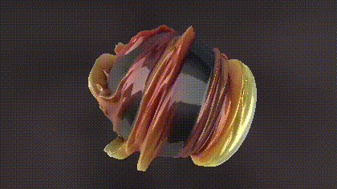
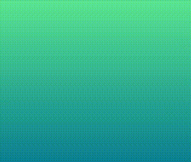

> Backup of the [substack post](https://ricardohs.substack.com/p/easily-create-your-standalone-setup)

# Easily create your standalone setup to develop shaders with Three.js

*Shader of the week in [shadertoy.com](https://www.shadertoy.com/view/4t2SWW) by aiekick.*

> TL;DR;
> If you are looking for a ready-to-use template, go here:
> https://github.com/RicardoHS/shaders_threejs_minimal_template

# A myriad of options

When it comes to developing shaders, finding the right setup can be a bit daunting. There's a myriad of options out there, ranging from complex desktop applications like Unity to online tools that require a constant internet connection. Fortunately, there's a simpler and more accessible solution that empowers you to create shaders with ease and flexibility: Three.js.

## Why Three.js?
Three.js stands out as one of the best options for developing 3D graphics in web, shaders included. For our use case it's the best option due to its lightweight nature, seamless hot reloading capabilities, and standalone setup. Unlike heavier solutions that demand significant system resources, Three.js offers a straightforward approach to shader development, making it suitable for both beginners and experienced developers. We can write shaders directly in GLSL and their community is huge too.

Here's why Three.js deserves your attention:

1. Lightweight and Efficient: Three.js is designed to be lightweight, making it easy to set up and use without overwhelming your system. You won't be bogged down by unnecessary complexities or resource-intensive processes.

2. Hot Reloading: Thanks to Three.js and Vite, you can enjoy the benefits of fast hot reloading. This means that any changes you make to your shader code are immediately reflected in the rendering, allowing you to iterate and experiment quickly.

3. Standalone Setup: Unlike some solutions that tie you to specific platforms or require constant internet connectivity, Three.js operates within your web browser. All you need is a web browser and npm (Node Package Manager) to get started + your favorite IDE.

4. Versatility: Once you've crafted your shaders using Three.js, they can be seamlessly integrated into your own web projects. This flexibility enables you to use your creations for a wide range of applications.

## Building the Three.js Shader Development Setup
Setting up your shader development environment with Three.js is a breeze. Follow these steps to get started:

1. Clone the Template: https://github.com/RicardoHS/shaders_threejs_minimal_template

2. Install npm: Make sure you have npm (Node Package Manager) installed on your system. You'll need this to manage dependencies and run scripts.

3. Install Dependencies: Navigate to the root path of the cloned repository using your command-line interface. Run the command `npm install` to install the required dependencies.

4. Run the Development Server: Execute `npx vite` in your command-line interface. This command will start the development server, and you can access your shader development environment by visiting http://localhost:5173/ in your web browser and you will see this sample shader. Try moving the mouse around.

5. Start Creating: With the development server up and running, you're ready to start creating shaders. Enjoy the benefits of hot reloading and experiment with your shader code without any hassle.

## What's Inside the Template?
The Three.js shader development template comes with everything you need to kickstart your shader creation journey:

- three.js: Provides you the foundation for rendering shaders in your web browser, making it an essential component of the template.

- vite: Vite is a build tool that offers fast and efficient development. It enables a liver server with hot reloading and simplifies the development process.

- vite-plugin-glsl: This plugin facilitates hot reloading of GLSL scripts, ensuring a clean and organized folder structure for your shader code.

- main.js Script: The main.js script sets up the initial configuration for Three.js along with shaders. You don't need to worry about complex configurations; it's all taken care of.

- Minimal Shader Scripts: The template includes two minimal shader scripts that you can easily plug-and-play. This provides a starting point for your own shader creations.

In conclusion, Three.js provides an accessible and powerful solution for developing shaders without the need for heavyweight desktop applications or constant internet connectivity. With its lightweight nature, hot reloading capabilities, and standalone setup, you can create and experiment with shaders effortlessly. By following the simple steps outlined in this guide, you'll be well on your way to crafting stunning visual effects and integrating them into your projects with ease. Happy shader coding!

## What now?

At this precise moment you are completely ready to start coding shaders. This is one of a set of blogs explaining my journey learning shaders. In the next post I'll be explaining the widely used function `smoothstep()` ([doc](https://registry.khronos.org/OpenGL-Refpages/gl4/html/smoothstep.xhtml)) in detail and how it's used in the [5th chapter of The book of shaders](https://thebookofshaders.com/05/) to draw lines and how can we use it for much more.

If you want to learn shaders too, please, start reading [The book of shaders](https://thebookofshaders.com/) resource first. It's possibly the best resource from an entrypoint perspective. If you feel overwhelmed come back and I'll be filling the gaps with deep explanations and some exercises that are more narrowed and require less of you.

You can check the [previous post here](https://ricardohs.github.io/notes/03-shaders-1).

Or if you want, you can [subscribe to my newsletter](https://ricardohs.substack.com/?r=1k58g7&utm_campaign=pub-share-checklist) to stay up-to-date when new post are published.
