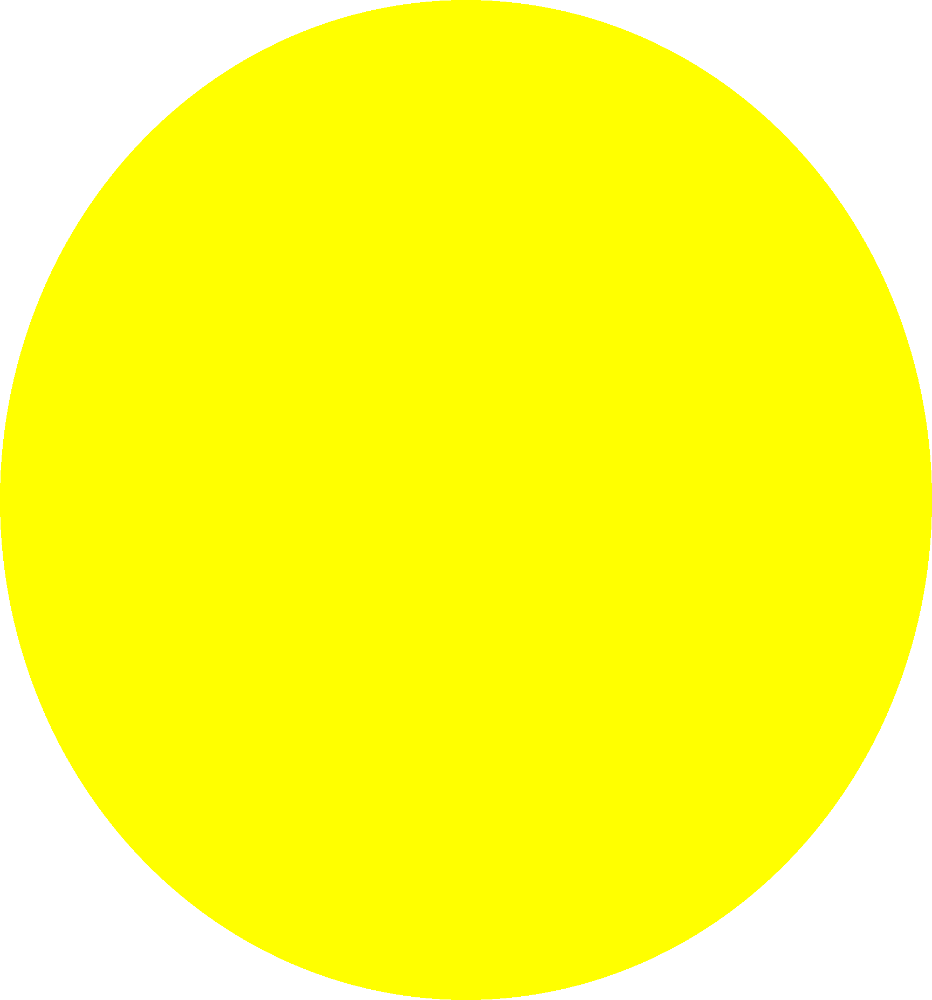
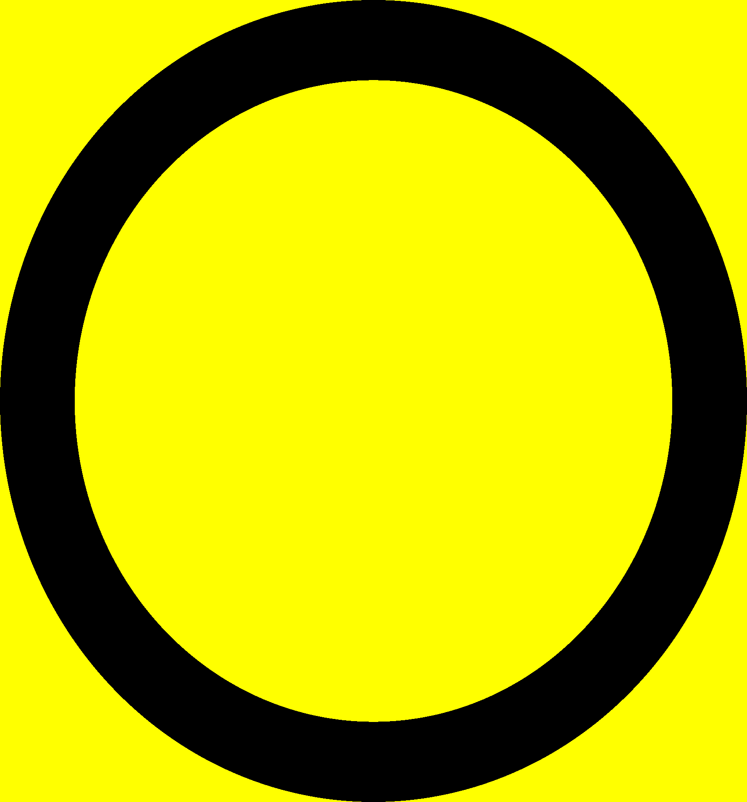
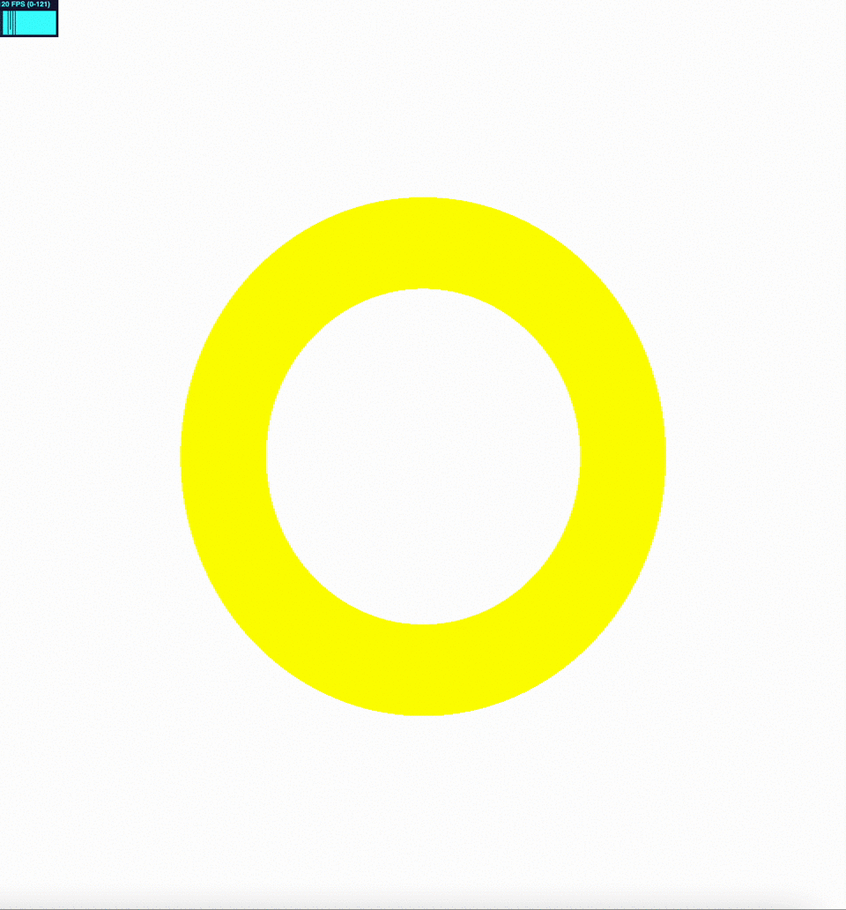

> Backup of the [substack post](https://ricardohs.substack.com/p/understanding-the-smoothstep-function)

# Understanding the smoothstep function in GLSL

> This post is expected to serve as a clarification to the 5th chapter of The Book of Shaders. Go there first ([link](https://thebookofshaders.com/05/))

## A complex starting point

Despite the [5th chapter of The book of shaders](https://thebookofshaders.com/05/) being a great resource to start on the shader programming, it could take too much from a completely beginner.

Patricio starts the technical part with a code snippet that directly uses the smoothstep function. It’s not straightforward what this function does. It gets worse with the following examples due the combination of multiple function calls (in the plot function).

Also, in the middle of the chapter, he asks the reader to replace the pow() function with exp(), log() and sqrt() function without much guidance. It finalizes the post with much simple code.

In short, and after reviewing the chapter to write this post, it seems to me that its structure has been turned upside down.

Anyway, let’s get down to a most deeper explanation on the smoothstep function, how it’s used and hopefully you will get empowered again to retake the book.

## Always start with the simplest case

Use this simple code to start. You can use the template of the [previous post](https://ricardohs.github.io/notes/04-shaders-2.md) to build your own offline environment and run this shader directly in your browser.

```c
#ifdef GL_ES
precision mediump float;
#endif

uniform vec2 u_resolution;
uniform vec2 u_mouse;
uniform float u_time;

void main() {
    vec2 st = gl_FragCoord.xy/u_resolution;

    vec3 gradient = vec3(smoothstep(0., 1., st.x));
    vec3 color = vec3(1.0,1.0,.0);
    gradient += color;

    gl_FragColor = vec4(gradient,1.0);
}
```

Now it’s easy to visualize what the smoothstep function does and to play with it. Change the values in the line 12 to see how it affects the shader. For example, change 0. to 0.5 or st.x to st.y.

Regarding colors. If you comment the line 14 you will get a confusing gradient in which more than half of the screen is taken by the white color, or at least it’s what it looks. Don’t get confused. This effect is caused due the interaction between white and black. We will see why this happens in following posts. For the moment, stick to white and yellow to avoid undesired effects in our perception.

Now that we have a more simplistic example in which we can visualize more directly what the smoothstep does, we are ready to deep dive on the math. Do not afraid, it’s more simple than it looks. One of the most though aspects in maths is nomenclature.

## Maths

Instead of looking to the [definition provided by Patricio](https://thebookofshaders.com/glossary/?search=smoothstep) (the same as [OpenGL docs](https://registry.khronos.org/OpenGL-Refpages/gl4/html/smoothstep.xhtml)), look to [this explanation in stackoverflow that uses python](https://stackoverflow.com/questions/45165452/how-to-implement-a-smooth-clamp-function-in-python/45166120#45166120). Don’t look to the math definition ([taken from wikipedia](https://en.wikipedia.org/wiki/Smoothstep)) and just study the code.

It uses the comb() function [from scipy](https://docs.scipy.org/doc/scipy/reference/generated/scipy.special.comb.html) and basically it implements literally the math definition. If you are not familiar with combinatorics, check this [khan academy unit](https://www.khanacademy.org/math/statistics-probability/counting-permutations-and-combinations). You are interested in the 3th section called “Combinations” but it’s okay to check the first two called “Counting principle and factorial” and “Permutations”.

After understanding the formula, the second most important thing to notice is that the function takes a parameter called N. This parameter defines the “smoothness” of the function. You can visualize in the provided plot.


Source: stackoverflow.
As you can see, with higher values of N more “smooth” is the curve. This smoothness is achieved by differentiating the function N times. That is, computing the derivative N times for the provided points (x parameter).

If you check the OpenGL documentation, it saids that the smoothstep function is implemented using the cubic hermite interpolation. Despite the bombastic name, it simply means that N=2. That corresponds to the green line in the plot. That’s all.

Now the other parameters. The edge0 and edge1 simply defines the lower and upper limit of the interpolation. In other words, from which value the smoothness starts and to which value it stops. Any value below edge0 will equals to 0 and any value greater than edge1 will be 1. This can visualized too in the plot. There, because edge0=0 all points to the left in the x axis at value 0 are 0 and because edge1=1 all values to the right in the x axis at value 1 are 1.

This values are exactly the ones you have changed in the shader code earlier. Repeat the code change now to truly understand how it’s related to the provided math explanation.

Finally, if you invert the values, being edge0 > edge1 you simply inverse the interpolation. Any value below 0 or greater than 1 from edge0 and edge1 will force the interpolation to start or end outside the boundaries. Play with these three values till you are totally sure how they work.

As an exercise try to draw this circle exactly as it is by just changing the values of the three parameters provided in the smoothstep function. Force yourself to think about it.

Do it now before continuing because otherwise you will see the solution and you need to start training your problem solving intuition. If you feel lost, search for "circle function" and note that the sqrt() function is available in GLSL.



Try to match exactly the limit of the circle with the sides of the shader. In other words, draw an unit circle.
Now, you must perfectly control the behaviour of the circle. You must be able to draw it with any radius length and on any position, not just in the center of the screen.

## Mastering the smoothstep

Let’s try to focus on what Patricio did to draw that green line in the chapter but instead of using a line we will use our circle.

We have drawn a circle filled with yellow but, How can we draw just the boundary? in other words, How can we draw a white circle with a yellow border?

If you notice it, smoothstep() just returns a single float value, and it's with the combination of the different parallel calls to the main function that we succeed at drawing the circle (a deep explanation of this parallel calls can be found on the [first post](https://ricardohs.github.io/notes/03-shaders-1.md)).

With this in mind, would not be straightforward to just draw another white circle inside our yellow one but just a little bit smaller to achieve the desired border?

That's exactly what are we going to do, but because we need to return RGB pixel values and the yellow is already (255,255,0) we cannot add the circle but instead subtract it. Another smoothstep will do the work.

```c
void main() {
    vec2 st = gl_FragCoord.xy/u_resolution;

    float r = 0.5;
    // the previous code to draw the circle
    float shape = sqrt(pow(st.x-0.5,2.)+pow(st.y-0.5,2.));
    // the new smoothstep call
    // Change the first 0.1 value to 0.05 to see what happens
    float y = smoothstep(r,r,shape)-smoothstep(r-0.1,r-0.1,shape);
    vec3 gradient = vec3(y);
    vec3 color = vec3(1.0,1.,.0);
    gradient += color;

    gl_FragColor = vec4(gradient,1.0);
}
```

And it draw this…



Whoops!!!
What is happening here? We were expecting a white circle with yellow border on a white background, not a yellow circle with black border on a yellow background.

The answer is straightforward. You can visualize it if you remove the first smoothstep call.

Because smoothstep applies to all the image (not just the inner circle) when subtracting both smoothsteps, it gets values equal to 0 to all RGB components in the black border and (1.,1.,0.) for the yellow areas. Just adding 1. solves the issue. (Be sure to understand this paragraph)

```c
void main() {
    [...]
    float y = 1. + smoothstep(r,r,shape) - smoothstep(r-0.1,r-0.1,shape);
    [...]
}
```

Congrats!! If you have understand this part you are probably ready to review the 5th chapter of The book of shaders again and play with the green line and subdue the code. It takes a little bit of effort, but you are also ready to change the pow() function with exp(), log() and sqrt() in the code snippets too.

As a final exercise try to replicate the following effect by using the u_time variable. If you feel lost, you must use the sin() and abs() functions.



## What now?

This is one of a set of blogs explaining my journey learning shaders. In the next post I'll be explaining color theory and how it affects our shaders. You will understand why using black and white in these examples has not have the same results as using yellow and white.

If you want to learn shaders too, please, start reading [The book of shaders](https://thebookofshaders.com/) resource first. It's possibly the best resource from an entrypoint perspective. If you feel overwhelmed come back and I'll be filling the gaps with deep explanations and some exercises that are more narrowed and require less of you.

You can [subscribe to my newsletter](https://ricardohs.substack.com/?r=1k58g7&utm_campaign=pub-share-checklist) to stay up-to-date when new post are published.
